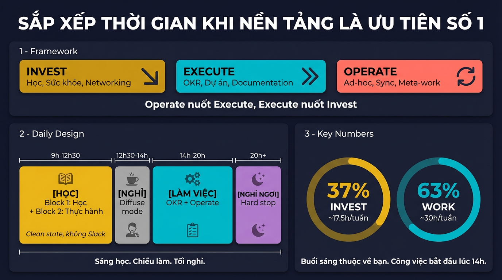

# Sắp xếp thời gian khi kỹ năng nền tảng là ưu tiên số 1

Bạn muốn trau dồi kỹ năng nền tảng — những thứ quan trọng nhất cho sự nghiệp dài hạn. Đồng thời bạn phải chạy theo OKR — triển khai dự án, hoàn thành mục tiêu quý. Và mỗi ngày vẫn có sự cố cần xử lý, ad-hoc task cần giải quyết, tin nhắn cần trả lời. Kết quả: cuối tuần nhìn lại, bạn bận rộn cả tuần nhưng không tiến gần hơn bất kỳ mục tiêu dài hạn nào.

Khi bạn đang ở giai đoạn cần xây nền tảng — dù là software engineer, data engineer, DevOps, hay bất kỳ vai trò nào trong tech — đây là giai đoạn quyết định. Nền tảng phải vững trước khi mở rộng. Và nền tảng chỉ vững khi bạn **ưu tiên việc học trước mọi thứ khác** — không phải "khi nào rảnh thì học", mà là "học xong rồi mới bắt đầu làm".

Bài viết này chia thành ba phần: phần đầu là framework chung — cách nhìn nhận thời gian, thiết kế ngày và tuần — áp dụng được cho bất kỳ ai trong ngành. Phần giữa lấy Data Engineer làm ví dụ cụ thể — lộ trình kỹ năng, cách học bằng dự án. Phần cuối quay về những nguyên tắc phổ quát — accountability, review, và cách phục hồi khi trượt.



<!-- more -->

## 1. Invest, Execute, Operate — một quỹ thời gian

Khi liệt kê công việc, bạn thường chỉ nghĩ ra thứ đang chiếm tâm trí: học, OKR, bug. Nhưng thực tế, thời gian của bạn bị chia cho nhiều thứ hơn — bao gồm cả những thứ "vô hình" mà bạn không ghi vào danh sách nhưng vẫn ăn thời gian mỗi ngày.

Toàn bộ công việc có thể gom lại thành ba chế độ:

**Đầu tư (Invest)** — không ai yêu cầu, không có deadline, dễ bỏ qua nhất:

| Loại | Ví dụ | Tầm ảnh hưởng |
| --- | --- | --- |
| Học & xây nền tảng | Học kỹ năng cốt lõi, viết blog, tổng hợp kiến thức | 6 tháng – 5 năm |
| Sức khỏe & năng lượng | Tập thể dục, ngủ đủ giấc, nghỉ ngơi có chất lượng | Mỗi ngày → cả đời |
| Networking & mối quan hệ | 1-on-1, xây quan hệ cross-team, community, mentoring | 1 – 5 năm |

**Thực thi (Execute)** — có mục tiêu, có deadline:

| Loại | Ví dụ | Tầm ảnh hưởng |
| --- | --- | --- |
| OKR & dự án | Triển khai công nghệ mới, xây hệ thống mới | 1 quý – 1 năm |
| Documentation & chia sẻ kiến thức | Viết ADR, runbook, code review, mentoring junior | 1 quý – 2 năm |

**Vận hành (Operate)** — phát sinh, giữ cho mọi thứ không đổ:

| Loại | Ví dụ | Tầm ảnh hưởng |
| --- | --- | --- |
| Ad-hoc & sự cố | Fix bug, ad-hoc request, trực on-call | Hôm nay – tuần này |
| Giao tiếp & sync | Họp, trả lời tin nhắn, sync progress | Hôm nay – tuần này |
| Meta-work | 1-on-1 prep, performance review, tổ chức task board, dọn notes | Liên tục |

Và quy luật luôn giống nhau: **Operate nuốt Execute, Execute nuốt Invest**. Thứ gấp nhất ăn trước, thứ quan trọng nhất ăn cuối. Bug production la hét — nhưng không ai la hét khi bạn không tập thể dục, không xây networking, không học kỹ năng mới.

Bài viết này tập trung vào cách **bảo vệ phần Invest** — vì đó là phần bị nuốt đầu tiên, nhưng lại quyết định bạn đi được bao xa.

---

## 2. Tại sao phần Invest luôn bị hy sinh?

Vì não ưu tiên thứ gấp hơn thứ quan trọng.

Bug production cần fix ngay → cảm giác cấp bách.

OKR cuối quý chưa xong → áp lực từ team.

Học kỹ năng nền tảng → không ai hỏi, không ai đợi, không ai biết bạn chưa học.

Tập thể dục → "mai tập cũng được".

Networking → "bận quá, để khi nào rảnh".

Đây là cái bẫy mà Eisenhower đã mô tả: **"Thứ quan trọng hiếm khi gấp, và thứ gấp hiếm khi quan trọng."**

Nếu bạn để lịch trình bị điều khiển bởi sự gấp gáp, việc học sẽ luôn bị đẩy về "khi nào rảnh". Và "khi nào rảnh" không bao giờ đến.

---

## 3. Nguyên lý: Quản lý năng lượng, không chỉ quản lý thời gian

Bạn không thể tạo thêm giờ. Nhưng bạn có thể quyết định giờ nào dành cho việc gì — và quan trọng hơn: **giờ nào não bạn ở trạng thái phù hợp nhất cho loại việc nào**.

**Mỗi loại công việc cần một chế độ tư duy khác nhau:**

* Học sâu cần *deep work* — không bị ngắt, tập trung cao, ít nhất 90 phút liên tục
* OKR cần *project work* — lập kế hoạch, phối hợp, review tiến độ
* Việc hàng ngày cần *reactive work* — phản hồi nhanh, xử lý gọn, không để tồn đọng

Trộn lẫn ba chế độ này trong cùng một khung giờ = không chế độ nào hoạt động đúng. Nghiên cứu của Gloria Mark (UC Irvine) cho thấy: sau mỗi lần bị ngắt, não cần trung bình **~23 phút** để lấy lại mức tập trung ban đầu. Một tin nhắn Slack "check nhanh" lúc 10h sáng có thể phá hỏng cả block deep work 90 phút.

Khoa học về nhịp sinh học (*ultradian rhythm*) cho thấy: não hoạt động theo chu kỳ ~90 phút tập trung, sau đó cần ~20 phút nghỉ. Buổi sáng (sau khi ngủ đủ) là lúc cortisol cao nhất — khả năng tập trung và tư duy logic đạt đỉnh. Chiều muộn là lúc phù hợp hơn cho công việc phối hợp, giao tiếp, xử lý tác vụ nhỏ.

Nắm được nhịp này, câu trả lời trở nên rõ ràng: **sáng học, chiều làm, tối nghỉ**. Không cần cố gắng hơn — chỉ cần đặt đúng việc vào đúng giờ.

---

## 4. Thiết kế ngày: Học trước, làm sau, tối nghỉ ngơi

Làm remote fulltime cho bạn một lợi thế lớn: **toàn quyền kiểm soát lịch trình ngoài core hours**. Và nếu việc học là ưu tiên số 1 trong giai đoạn này, thì nó phải đứng đầu tiên trong ngày — trước khi bất kỳ thứ gì khác có cơ hội xâm phạm.

Mỗi ngày chia thành ba phase rõ ràng:

```
09h  09h05 ─────── 12h30 ──── 14h ──── 20h ──── Tối
[TR]  [HỌC]         [nghỉ]    [LÀM VIỆC]  [NGHỈ NGƠI]
5min  2 block 90'   ăn trưa   OKR, sync   thư giãn
scan  clean state   chuyển    ad-hoc      nạp năng lượng
alert không Slack   giao      reactive    
```

### Phase 1 — Buổi sáng: Học (9h–12h30)

Đây là vùng thiêng. Não vừa qua một đêm consolidate ký ức — đây là lúc tươi nhất, sạch nhất, phù hợp nhất cho deep work.

**Bước 0 — Triage 5 phút (9h00–9h05)**

Trước khi học, mở **đúng một channel**: alert channel trên Slack. Chỉ tìm một thứ duy nhất: **có sự cố nghiêm trọng (P0/P1) đang xảy ra không?**

* **Không có gì cháy** → đóng Slack, tắt notification, bắt đầu học. Mọi thứ khác đợi đến 14h.
* **Có sự cố nghiêm trọng** → xử lý hoặc escalate ngay. Học dời sang sau khi ổn định (nhưng vẫn giữ ít nhất Block 1 trong ngày).

Quy tắc sống còn: **triage không phải browsing**. Mở alert channel, scan, đóng. Không lướt sang channel khác. Không đọc threads. Không check tin nhắn. 5 phút nhìn alert → quyết định → đóng Slack hoàn toàn. Nếu bạn thấy mình đang cuộn sang channel khác, bạn đã ra khỏi triage rồi.

**Sau triage, bắt đầu deep work:**

Mỗi buổi sáng = 2 block 90 phút:

* **Block 1 (9h05–10h35)**: Học nền tảng — những kỹ năng bạn *cần* và *thích*. Thứ quan trọng nhất cho sự nghiệp dài hạn.
* **Nghỉ 15 phút**: đi lại, uống nước, không nhìn màn hình.
* **Block 2 (10h50–12h20)**: Thực hành hoặc viết — code trong sandbox, viết blog tổng hợp, vẽ sơ đồ hệ thống từ trí nhớ.

Sau block 2: ghi chú nhanh 5 phút — hôm nay học được gì, mai tiếp ở đâu. Đây là seed cho active recall ngày hôm sau.

### Giữa hai phase — Buổi trưa (12h30–14h)

Đây không phải thời gian chết. Ăn trưa, nghỉ ngơi thật sự — power nap 20 phút, đi dạo, hoặc đơn giản là không nhìn màn hình. Não cần thời gian để xử lý những gì vừa học buổi sáng (*diffuse mode*). Nhiều insight bất ngờ xuất hiện khi bạn không cố gắng suy nghĩ.

### Phase 2 — Chiều: Làm việc (14h–20h)

Bắt đầu core hours. Bây giờ mới mở Slack, check OKR board, xem danh sách tech debt, ad-hoc tasks.

* **14h–15h**: Scan tổng quan — có gì urgent không? OKR cần push gì hôm nay? Ad-hoc nào cần xử lý?
* **15h–18h**: Block lớn cho OKR — code, review, sync với team, họp. Đây cũng là lúc cho **networking**: 1-on-1 với manager, coffee chat với đồng nghiệp cross-team, mentoring. Remote worker không có "gặp ở hành lang" — nếu không chủ động đặt lịch, bạn sẽ vô hình.
* **18h–20h**: Xử lý ad-hoc, trả tin nhắn, documentation, dọn dẹp, chuẩn bị cho ngày mai.

### Phase 3 — Tối: Nghỉ ngơi & nạp năng lượng

Hard stop lúc 20h. Không "làm thêm chút nữa". Không mở laptop "check nhanh một cái".

Đây là thời gian cho phần **Invest** mà nhiều người quên: sức khỏe. Tập thể dục (30-45 phút đi bộ, chạy, hoặc workout), thời gian cá nhân, đọc sách không liên quan đến công việc. Remote worker ngồi 10 giờ/ngày — nếu không chủ động vận động, **cơ thể sẽ trả giá trước, rồi não trả giá sau.**

Nghỉ ngơi tốt buổi tối = buổi sáng mai não tươi hơn = học hiệu quả hơn. Đây không phải lãng phí thời gian — đây là đầu tư cho phase 1 ngày hôm sau.

### Thiết kế tuần mẫu

| | 9h–10h35 (Block 1: Học) | 10h50–12h20 (Block 2: Làm) | 14h–20h (Work) |
| --- | --- | --- | --- |
| **T2** | Học lập trình | Thực hành: code trong sandbox | Lập kế hoạch tuần, OKR sync, 1-on-1 |
| **T3** | Học hệ thống | Thực hành: dựng/debug trên homelab | OKR deep work: code, thiết kế |
| **T4** | Học lập trình | Thực hành: build side project/CLI tool | OKR deep work, code review |
| **T5** | Học hệ thống | Đọc source code / nghiên cứu sâu | OKR review, sync, documentation |
| **T6** | Tổng hợp tuần: viết blog | Review ghi chú, vẽ sơ đồ từ trí nhớ | Dọn ad-hoc/BAU, tech debt, prep tuần sau |
| **T7** *(opt)* | Học mở rộng / chủ đề yêu thích | Side project tự do | Nghỉ |

Xen kẽ lập trình ↔ hệ thống giữa các ngày (interleaving) giúp não tạo liên kết chéo giữa hai lĩnh vực — đúng nguyên lý từ bài "Học nhanh. Nhớ lâu." Thứ 6 dành cho tổng hợp: viết lại những gì đã học trong tuần bằng ngôn ngữ của mình, vẽ sơ đồ từ trí nhớ (active recall), kết nối kiến thức mới với kiến thức cũ (spaced repetition).

**Tuần bận** (urgent tasks dồn dập): buổi sáng vẫn giữ ít nhất Block 1 (90 phút). Hy sinh Block 2 nếu cần, nhưng **không bao giờ hy sinh Block 1**. 90 phút/ngày là đường ranh cuối cùng.

**Tuần thảnh thơi**: mở rộng Block 2 thành thực hành sâu hoặc side project. Có thể kéo dài deep work đến 13h30.

Nguyên tắc then chốt: **buổi sáng thuộc về bạn**. Công việc bắt đầu lúc 14h. Trước đó, bạn là học sinh, không phải nhân viên.

---

## 5. Phân bổ thời gian: Hai khối, không phải ba

Trên lý thuyết có ba chế độ (Invest, Execute, Operate). Nhưng trong thực tế, lịch trình chỉ có **hai khối**:

```
Buổi sáng: INVEST (~37%)
Buổi chiều: WORK = Execute + Operate (~63%)
```

* Buổi sáng: ~3.5h × 5 = **~17.5h cho Invest**
* Core hours: ~6h × 5 = **~30h cho Work (OKR + ad-hoc/BAU)**
* Tổng: ~47.5h (thêm T7 nếu muốn)

Ad-hoc và BAU tasks hầu như tuần nào cũng có — lúc nhiều lúc ít, không dự đoán được. Chúng không phải một block riêng mà **xen vào core hours**, trộn lẫn với OKR. Có tuần ad-hoc chiếm 1-2h, có tuần chiếm 10h. Vì vậy, cố gắng phân tách "50% OKR, 13% ad-hoc" là không thực tế.

Cái thực sự cố định chỉ có một thứ: **buổi sáng thuộc về Invest**. Buổi chiều, bạn linh hoạt giữa OKR và Operate tùy tuần.

| | Thông thường | Giai đoạn đẩy nhanh nền tảng |
| --- | --- | --- |
| Invest (sáng) | ~20% | **~37%** |
| Work (chiều) | ~80% | **~63%** |

Tại sao gần 40% cho Invest? Vì bạn đang ở giai đoạn xây nền móng — những kỹ năng cốt lõi mà nếu không nắm vững bây giờ, sẽ giới hạn bạn ở mọi bước tiếp theo. Nền móng yếu thì tầng trên không vững. Đầu tư bây giờ sẽ trả lãi kép khi bạn bước vào những bài toán phức tạp hơn sau này. Giai đoạn này không kéo dài mãi — khi nền tảng vững, tỷ lệ sẽ tự nhiên dịch về 20-80.

Khi ad-hoc/BAU liên tục chiếm hết core hours khiến OKR không tiến được, đó là tín hiệu hệ thống có vấn đề — không phải lịch trình của bạn có vấn đề. Hãy fix hệ thống (monitoring tốt hơn, documentation, automation) thay vì hy sinh thời gian Invest.

---

## 6. Ví dụ cụ thể: Lộ trình học cho Data Engineer

Framework ở trên áp dụng cho bất kỳ ai trong tech. Nhưng "học gì" thì phụ thuộc vào vai trò. Phần này lấy **Data Engineer** làm ví dụ — bạn có thể thay bằng lộ trình phù hợp với chuyên môn của mình.

Có ~17.5 giờ/tuần để học nhưng không biết học gì → lãng phí. Nền tảng cần nắm vững trước khi mở rộng:

### Giai đoạn 1 — Nền tảng cứng (3-6 tháng đầu)

| Kỹ năng | Tại sao quan trọng | Mức độ cần đạt |
| --- | --- | --- |
| **SQL nâng cao** | Kỹ năng cốt lõi nhất — dù có background DWH, lâu không dùng sẽ rỉ sét | Refresh + nâng cấp: window functions, CTEs phức tạp, query optimization, execution plans, partitioning strategies |
| **Python nâng cao** | Ngôn ngữ chính cho data pipeline, scripting, automation | Viết code production-ready, hiểu async, testing, packaging |
| **Go** | Ngôn ngữ cho tooling, CLI, high-performance services | Đọc hiểu source code K8s, viết operator/CLI đơn giản |
| **Shell script** | Glue code cho mọi thứ, automation, CI/CD | Viết script robust, xử lý error, idempotent |
| **Networking cơ bản** | Điểm mù #1 khi debug K8s và Cloud — không hiểu mạng thì không troubleshoot được | DNS, TCP/IP, HTTP/gRPC, TLS, load balancing, firewall rules, proxy |
| **Kubernetes nâng cao** | Nền tảng chạy mọi thứ | Hiểu networking, RBAC, operator pattern, troubleshooting |
| **Cloud platform** | Infrastructure thực tế | IaC (Terraform/Pulumi), networking, IAM, cost management |

### Giai đoạn 2 — Mở rộng chiều sâu (6-12 tháng)

| Kỹ năng | Tại sao quan trọng | Xây trên nền tảng nào |
| --- | --- | --- |
| **Data Modeling nâng cao** | Có background DWH nhưng modern data stack đã thay đổi nhiều | SQL + kinh nghiệm DWH → lakehouse patterns, schema evolution, medallion architecture, slowly changing dimensions |
| **Streaming & Event-Driven** | Batch không đủ nữa — real-time ngày càng là yêu cầu cơ bản | Kafka/Pub-Sub, CDC (Change Data Capture), event sourcing, exactly-once semantics |
| **Data Quality & Data Contracts** | Pipeline chạy xanh ≠ dữ liệu đúng — đây là thứ phân biệt platform tin cậy vs mong manh | Định nghĩa SLAs cho data, testing strategy (dbt tests, Great Expectations), data freshness, completeness |
| **AI/ML fundamentals** | Hiểu workload mình phục vụ | Python + Cloud |
| **DataOps** | Giao điểm DevOps + Data Engineering | K8s + CI/CD + Python + Cloud |
| **Observability** | Monitoring, logging, tracing cho data pipeline | K8s + Cloud + Shell |
| **Data platform design** | Kiến trúc tổng thể — kết nối tất cả thành một hệ thống có chủ đích | Tất cả ở trên |

### Phân bổ ~17.5h/tuần cho học

* **Block 1 mỗi sáng (~7.5h/tuần)**: Học nền tảng thuần túy — thứ bạn cần và thích, không liên quan đến task hôm nay. Đọc tài liệu, xem bài giảng, nghiên cứu concept mới.
* **Block 2 mỗi sáng (~7.5h/tuần)**: Thực hành có output — code trong sandbox, viết blog, vẽ sơ đồ, build side project. Khi có thể, ghép với OKR: học kỹ năng mới bằng cách áp dụng vào dự án thực tế. *Học và OKR không đối lập — chúng bổ trợ nhau.*
* **T6 sáng (~2.5h)**: Tổng hợp tuần — viết blog, review ghi chú, kết nối kiến thức mới với kiến thức cũ (đúng spaced repetition).

---

## 7. Học bằng dự án, không bằng tutorial

Đây là thứ nhiều kỹ sư bỏ qua: **xem tutorial không phải là học**.

Xem 10 video hướng dẫn = tiêu thụ thông tin.
Tự dựng hệ thống, cố tình tạo lỗi, debug đến khi hiểu = kiến tạo tri thức.

Cách áp dụng framework "Học nhanh. Nhớ lâu." vào từng kỹ năng:

| Kỹ năng | Dự án thực hành (tạo áp lực nhận thức) |
| --- | --- |
| **Go** | Viết CLI tool cho team (ví dụ: tool kiểm tra health data pipeline) |
| **K8s nâng cao** | Dựng homelab cluster, triển khai full stack, cố tình phá rồi sửa |
| **Cloud + IaC** | Viết Terraform module cho infra của team, review và refactor |
| **Shell script** | Viết automation cho CI/CD pipeline, thay thế manual steps |
| **AI fundamentals** | Deploy một ML model đơn giản lên K8s, từ training đến serving |

Sau mỗi dự án, áp dụng Tầng 4 từ bài "Học nhanh. Nhớ lâu.":

* **Viết lại**: blog post hoặc ADR giải thích quyết định thiết kế
* **Tự kiểm tra**: đóng tài liệu, vẽ lại kiến trúc từ trí nhớ
* **Dạy lại**: giải thích cho đồng nghiệp hoặc ghi âm cho chính mình

---

Phần trên là ví dụ cụ thể cho Data Engineer. Dù bạn ở vai trò nào, nguyên tắc không đổi: chọn nền tảng cứng trước, mở rộng sau, và học bằng dự án thay vì tutorial. Phần tiếp theo quay lại những thực hành phổ quát.

---

## 8. Hai thứ bạn có thể đang thiếu

### Sandbox cá nhân

Nhiều kỹ sư chỉ thực hành trên production hoặc staging của công ty. Khi muốn thử nghiệm, không có môi trường an toàn.

Giải pháp: dựng một **homelab** hoặc sandbox cá nhân (K8s cluster nhỏ, cloud free tier, local Docker Compose). Đây là nơi bạn được phép sai, được phép phá, được phép thử — thứ mà production không cho phép. Mỗi giờ thực hành trên sandbox tạo nhiều liên kết thần kinh hơn 10 giờ đọc docs.

### Accountability system

Có sandbox mà không có mục tiêu = noodling. Có mục tiêu mà không ai kiểm tra = trì hoãn. Bạn cần cả hai.

**Personal OKR — đặt mục tiêu cho việc học như đặt OKR cho công việc.**

Không ai tạo OKR học tập cho bạn. Bạn phải tự làm. Mỗi quý, đặt 1-2 objective cho việc học, mỗi objective có 2-3 key results đo được:

> **Objective**: Nắm vững kỹ năng X đủ để áp dụng trong công việc
>
> * KR1: Hoàn thành dự án Y trên sandbox (deadline: cuối tháng 2)
> * KR2: Viết 1 blog post giải thích kiến trúc đã build
> * KR3: Áp dụng vào ít nhất 1 task OKR công ty

Không có key results = không biết mình tiến hay đứng yên. "Học X" không phải mục tiêu — "build được Y bằng X" mới là mục tiêu.

**Hệ thống buộc mình phải output:**

* **Viết blog hàng tuần/hàng tháng** — deadline tự đặt nhưng công khai. Viết là cách kiểm tra mình thực sự hiểu hay chỉ tưởng là hiểu.
* **Weekly review 15 phút** — tự hỏi: tuần này tiến được bao nhiêu so với personal OKR?
* **"Learn in public"** — chia sẻ quá trình học trên blog, GitHub, hoặc community. Khi người khác đọc, bạn buộc phải hiểu sâu hơn trước khi viết (đúng Feynman Technique)
* **Tận dụng công việc hiện tại như môi trường thực hành** — công ty không chỉ là nơi deliver OKR. Đó là môi trường để bạn trải nghiệm hệ thống thật, sự cố thật, quy mô thật — thứ mà sandbox cá nhân không tái tạo được. Mỗi production issue bạn debug, mỗi hệ thống bạn thiết kế, đều là bài học. Đôi khi personal OKR trùng với OKR team — lúc đó bạn được "trả lương để học". Đôi khi không trùng — và đó là lý do bạn cần buổi sáng riêng.

---

## 9. Nói "không" là kỹ năng quan trọng nhất

Bạn không thể sắp xếp tốt nếu bạn nhận hết mọi thứ.

Khi một ad-hoc task đến, hãy hỏi:

* **Nó có thực sự cần giải quyết hôm nay không?** Nhiều thứ "gấp" thực ra có thể đợi đến thứ 6.
* **Mình có phải là người duy nhất làm được không?** Nếu không, chuyển đi.
* **Nếu mình nhận việc này, mình sẽ bỏ việc gì?** Mỗi "có" là một "không" cho thứ khác.

Không phải nói "không" cộc lốc. Mà là: *"Tôi có thể làm việc này, nhưng sẽ ảnh hưởng đến X. Bạn muốn tôi ưu tiên cái nào?"*

Chuyển quyết định ưu tiên về cho người yêu cầu — thay vì tự gánh hết.

---

## 10. Review tuần: 15 phút giữ cả hệ thống đứng vững

Mỗi thứ 6, trong khung core hours, dành 15 phút:

* **Tỷ lệ tuần này**: buổi sáng có được bảo vệ cho Invest không? Core hours bị ad-hoc nuốt bao nhiêu?
* **Vùng vàng buổi sáng**: mấy buổi sáng được bảo vệ? Mấy buổi bị xâm phạm?
* **Việc học có output không?** Viết được gì, build được gì, hay chỉ "đọc được vài trang rồi bị kéo đi"?
* **Tuần bận hay thảnh thơi?** Nếu thảnh thơi → tăng deep work. Nếu bận → bảo vệ ít nhất 1 buổi sáng cho học.
* **Tuần sau cần bảo vệ khung giờ nào?**

Không cần phức tạp. Một ghi chú ngắn, vài dòng, đủ để bạn thấy mình đang đi đúng hướng hay đang bị cuốn trôi.

---

## 11. Khi bạn trượt — và bạn sẽ trượt

Sẽ có tuần bạn bị cuốn hoàn toàn: urgent task dồn dập, deadline OKR cháy, buổi sáng bị xâm phạm liên tục. Cuối tuần nhìn lại: 0h học, 0 output cá nhân.

Phản ứng tự nhiên: tội lỗi → cố bù vào cuối tuần → kiệt sức → tuần sau lại trượt → bỏ cuộc.

**Đừng cố bù. Chỉ cần quay lại.**

Hệ thống này không yêu cầu hoàn hảo. Nó yêu cầu **quay lại**. Thứ 2 tuần sau, 9h sáng, mở lại đúng chỗ bạn dừng lần cuối. Ghi chú 5 phút cuối mỗi block tồn tại vì lý do này — để bạn không phải nhớ "mình đang ở đâu" sau một tuần gián đoạn.

Một tuần trượt không phá hủy hệ thống. Bỏ cuộc sau một tuần trượt mới phá hủy hệ thống.

---

## 12. Kết luận

Bạn không thiếu thời gian — gần 50 giờ/tuần là nhiều. Bạn thiếu hệ thống để bảo vệ thứ quan trọng nhất khỏi bị nuốt chửng bởi thứ gấp nhất.

Invest, Execute, Operate — ba chế độ sẽ luôn cạnh tranh. Không có tuần hoàn hảo. Nhưng có tuần *có chủ đích* và tuần *bị cuốn theo*.

Nguyên tắc sống còn: **học trước, làm sau**. Mỗi buổi sáng thuộc về bạn — clean state, không Slack, không email. Học xong, ghi chú xong, rồi mới bước vào thế giới công việc. Tối nghỉ ngơi, nạp lại năng lượng. Ba phase rõ ràng, không trộn lẫn.

Giai đoạn này không kéo dài mãi. Khi nền tảng vững, bạn sẽ tự nhiên chuyển từ 40% học xuống 25%, và dồn năng lượng vào những bài toán phức tạp hơn, những trách nhiệm lớn hơn. Nhưng trước đó, nền móng phải chắc.

Sự khác biệt nằm ở chỗ: bạn thiết kế ngày của mình, hay để ngày thiết kế bạn?

**Buổi sáng thuộc về bạn. Công việc bắt đầu lúc 14h. Tối dành cho nghỉ ngơi. Và nhớ: nền tảng vững thì tầng trên mới cao được.**

Bài viết này trả lời câu hỏi: **tìm thời gian ở đâu để học?** Còn câu hỏi tiếp theo — **học thế nào cho hiệu quả trong khoảng thời gian đó?** — được bàn trong bài [Học nhanh. Nhớ lâu.](overview.md) Hai bài là một cặp: một bài cho thời gian, một bài cho phương pháp.
